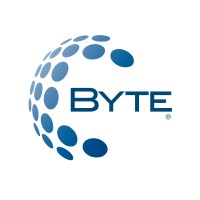

<div align="center">
  
  <h1>ByteCom Prueba Técnica</h1>
  <p><strong>Aplicación Android Moderna con Kotlin y Arquitectura MVVM</strong></p>
  
  [](https://kotlinlang.org)
  [](https://developer.android.com)
  [](https://material.io)
  [](https://android-arsenal.com/api?level=24)
  
</div>

---

##  Descripción

Aplicación móvil Android desarrollada como prueba técnica para **bytecom**, demostrando habilidades avanzadas en desarrollo nativo con Kotlin. La aplicación implementa un sistema completo de autenticación de usuarios y consumo de servicios REST, siguiendo las mejores prácticas de la industria y los principios de **Material Design 3**.

###  Objetivo del Proyecto

Demostrar competencias en:
- Desarrollo nativo Android con Kotlin
- Implementación de arquitecturas escalables (MVVM)
- Consumo de API REST con Retrofit
- Gestión de ciclos de vida y navegación
- Patrones de diseño y clean code
- Experiencia de usuario (UX) optimizada

---

##  Características

| Módulo | Descripción | Status |
|--------|-------------|--------|
|  **Autenticación** | Login y registro de usuarios con validaciones | ✅ Completo |
|  **Registro** | Formulario con validaciones en tiempo real | ✅ Completo |
|  **Dashboard** | Pantalla principal post-autenticación | ✅ Completo |
|  **API REST** | Integración con servicios backend mediante Retrofit | ✅ Completo |
|  **UI/UX** | Interfaz moderna con Material Design 3 | ✅ Completo |
|  **Responsive** | Adaptable a diferentes tamaños de pantalla | ✅ Completo |

---

##  Arquitectura

El proyecto implementa una arquitectura **MVVM (Model-View-ViewModel)** limpia y desacoplada, siguiendo los principios de **Clean Architecture**:


### Beneficios de la Arquitectura:
- ✅ **Separación de responsabilidades**: Cada capa tiene un propósito específico
- ✅ **Testabilidad**: Componentes desacoplados facilitan pruebas unitarias
- ✅ **Mantenibilidad**: Código organizado y fácil de modificar
- ✅ **Escalabilidad**: Preparado para crecer con nuevas funcionalidades

---

## 🛠️ Tecnologías

### Core
| Tecnología | Versión | Propósito |
|------------|---------|-----------|
| **Kotlin** | 1.9.0 | Lenguaje principal |
| **Android SDK** | API 34 | SDK de desarrollo |
| **Gradle** | 8.2 | Sistema de construcción |

### Libraries
| Librería | Versión | Propósito |
|----------|---------|-----------|
| **AndroidX Core KTX** | 1.12.0 | Extensiones Kotlin para AndroidX |
| **AppCompat** | 1.6.1 | Compatibilidad con versiones anteriores |
| **Material Design** | 1.11.0 | Componentes de Material Design 3 |
| **ConstraintLayout** | 2.1.4 | Layouts flexibles y performantes |
| **RecyclerView** | 1.3.2 | Listas optimizadas con view recycling |
| **CardView** | 1.0.0 | Tarjetas con sombras y bordes redondeados |
| **Fragment KTX** | 1.6.2 | Extensiones para fragments |

### Networking
| Librería | Versión | Propósito |
|----------|---------|-----------|
| **Retrofit** | 2.9.0 | Cliente HTTP tipo-safe |
| **Gson Converter** | 2.9.0 | Parseo JSON automático |
| **OkHttp Logging** | 4.12.0 | Interceptor para logs de red |

### Testing
| Librería | Versión | Propósito |
|----------|---------|-----------|
| **JUnit** | 4.13.2 | Framework de pruebas unitarias |
| **AndroidX Test** | 1.5.0 | Pruebas instrumentadas |
| **Espresso** | 3.5.1 | Pruebas de UI |

---

## 📋 Prerrequisitos

Antes de comenzar, asegúrate de tener instalado:

### Software Necesario

```bash
# Android Studio
Versión: Hedgehog | 2023.1.1 o superior
Descarga: https://developer.android.com/studio

# Java Development Kit (JDK)
Versión: 17 o superior
Descarga: https://adoptium.net/

# Android SDK
API Level: 34 (Android 14)
Build Tools: 34.0.0

# Git (opcional, para clonar)
Versión: 2.x o superior
```
---
## 📋 CLONAR EL REPO

```bash
# HTTPS
git clone https://github.com/elizabethcamilatoledo-tech/com.umg.bytecom

# SSH
git clone git@github.com/elizabethcamilatoledo-tech/com.umg.bytecom

# Navegar al directorio
cd com.umg.bytecom
```

---
## 📋 ABRIR EN ANDROID

```bash
# Opción 1: Desde Android Studio
File > Open > Seleccionar la carpeta del proyecto

# Opción 2: Desde terminal
studio ./

#-----------------Sincronizar Dependencias
# Desde Android Studio
File > Sync Project with Gradle Files

# O desde terminal
./gradlew build --refresh-dependencies

```